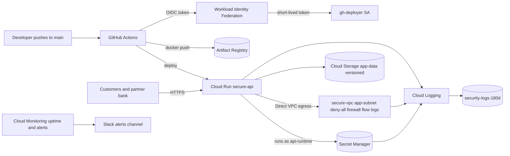

# Architecture

```mermaid
flowchart LR
  dev[Developer pushes to main] --> gha[GitHub Actions]
  gha -- OIDC token --> wif[Workload Identity Federation]
  wif -- short-lived token --> dep[gh-deployer SA]
  gha -- docker push --> ar[(Artifact Registry)]
  gha -- deploy --> run[Cloud Run secure-api]
  cust[Customers and partner bank] -- HTTPS --> run
  run -- runs as api-runtime --> sm[(Secret Manager)]
  run --> gcs[(Cloud Storage app-data versioned)]
  run -- Direct VPC egress --> vpc[secure-vpc app-subnet deny-all firewall flow logs]
  run --> logs[Cloud Logging]
  vpc --> logs
  sm --> logs
  logs --> lb[(security-logs-180d)]
  mon[Cloud Monitoring uptime and alerts] --> slack[Slack alerts channel]
```
